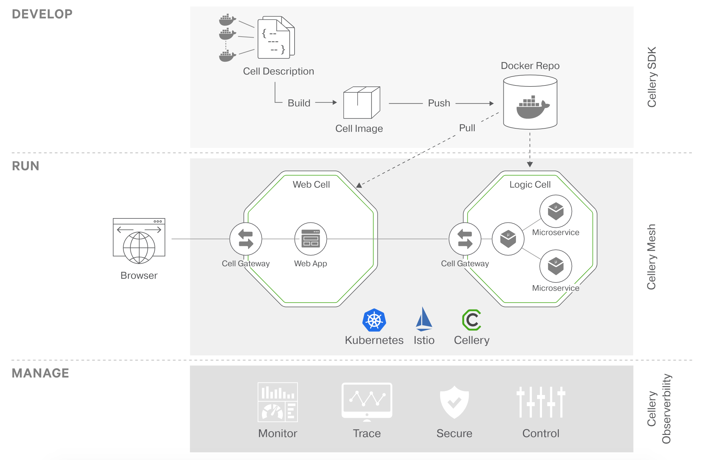

[](https://travis-ci.org/wso2-cellery/sdk)
[](https://codecov.io/gh/wso2-cellery/sdk)
[](https://github.com/wso2-cellery/sdk/releases)
[](https://github.com/wso2-cellery/sdk/releases)
[](https://github.com/wso2-cellery/sdk/commits/master)
[](https://opensource.org/licenses/Apache-2.0)


Build, run, and manage code-first composites on Kubernetes.

- For in-depth information about how to use Cellery, visit [https://wso2-cellery.github.io/](https://wso2-cellery.github.io/)                                   
- To ask questions and get assistance from our community, visit [wso2-cellery.github.io/discuss](https://wso2-cellery.github.io/discuss)
- To learn how to participate in our overall community, visit [our community page](https://wso2-cellery.github.io/about/community)

In this README:

- [Introduction](#introduction)
- [Why Cellery?](#why-cellery)
- [Quickstart guide](#quickstart-guide)
- [What's next?](#whats-next)

In addition, here are some other documents you may wish to read:
- [Cell Based Architecture](https://github.com/wso2/reference-architecture/blob/master/reference-architecture-cell-based.md) - explains the concepts of Cell based Architecture
- [Cellery Architecture](docs/cellery-architecture.md) - explains the high-level architecture of Cellery
- [How to code cells?](docs/cell-reference.md) - explains how Cellery cells are written
- [CLI commands](docs/cli-reference.md) - reference for CLI commands
- [Samples](https://github.com/wso2-cellery/samples) - a collection of useful samples
- [Cellery community](docs/community.md) - describes how to get involved and contribute to the Cellery project
- [Cellery roadmap](https://github.com/wso2-cellery/sdk/wiki) - provides the roadmap of the Cellery project

## Introduction

Cellery is a code-first approach to building, integrating, running and managing composite 
microservice applications on Kubernetes. Build, push/pull, run, scale and observe composites. 
Create secure APIs by default, code components in any language.

---
## Why Cellery?

The use of microservices and/or serverless functions is exploding as organisations aim to get better
agility and speed of development. This quickly gets out of control, resulting in tens or hundreds 
of microservices in a highly connected network. There is a strong need for an approach that helps 
create higher-level constructs from multiple microservices and serverless functions. 
Cellery aims to create composites with well-defined boundaries that fit with CI/CD pipelines and 
modern development and DevOps practices. 
You can read more about this approach [here](https://wso2-cellery.github.io/philosophy)



TODO: Need to explain the diagram

Cellery is composed of these components:

- **CLI** - TODO:
- **Mesh** - TODO:
- **Observability** - TODO:

---

## Quickstart Guide

The easiest way to setup Cellery is using the 'local' mode which installs a VirtualBox image. For other installation approaches including GCP and Docker for Desktop see [here](docs/installation-options.md)

### Prerequisites 
1. kubectl v1.11.x (Execute `kubectl version` command and make sure kubectl client is v1.11. 
Please follow [instructions](https://kubernetes.io/docs/tasks/tools/install-kubectl/) to install kubectl v1.11.x)
2. [VirtualBox](https://www.virtualbox.org/wiki/Downloads) 

### Download Cellery
#### Linux
Download the [cellery-ubuntu-x64-0.2.1.deb](https://wso2-cellery.github.io/downloads) 
and install it using dpkg command as shown below.
```
dpkg -i cellery-ubuntu-x64-0.2.1.deb
```
#### Mac OS
Download [cellery-0.2.1.pkg](https://wso2-cellery.github.io/downloads) 
and install it by following macOS package installation steps.

### Setup Cellery runtime
Once Cellery has been installed, verify the installation is working by executing `cellery version`.

In this quickstart guide, we will install a basic local Cellery runtime by running the following 
command:

**IMPORTANT:** Due to the [known issue](https://github.com/wso2-cellery/sdk/issues/381), please execute 
the all 'cellery' commands in any directory other than the home directory.

1. Run the local setup command. 

    ```
    cellery setup create local -y
    ```
    
    This may take a few minutes. If the setup was successful, you should see the following message:
    
    ```
    ✔ Runtime status (Cellery)...OK
    ```
    
2. Once the setup completes, run the following command to check the status:

    ```
    cellery list instances
    ```  
    
    You shouldn't see any errors. 
    
Now that we have installed Cellery let's validate that it is running using a simple cell.

### Hello world with Cellery

Let's quickly run a sample hello world cell as shown in the diagram below.  

 

The `hello-world-cell` contains one component `hello`. The `hello` component is defined by a container image which is written in Node.js and it is a simple webapp. In the quick start we will be deploying the `hello-world-cell`.

Now let's look at the steps required to run this cell. 

**IMPORTANT:** Due to the [known issue](https://github.com/wso2-cellery/sdk/issues/381), please execute 
the all 'cellery' commands in any directory other than the home directory.

1. Execute the `cellery run` command that will download the hello-world cell from the `wso2cellery` 
    organization in [docker hub](https://hub.docker.com/u/wso2cellery) and run the cell.
    
    ```
    $ cellery run wso2cellery/hello-world-cell:0.2.1 -n hello-world-cell
    ```
    
    You should see the following output:
    
    ```
    ✔ Connecting to registry-1.docker.io
    ✔ Fetching metadata
    ✔ Pulling image wso2cellery/hello-world-cell:0.2.1
    ✔ Saving new Image to the Local Repository
    
    Image Digest : sha256:2d5659e5787df7e7ae0f58671c0b9d857b5a19e5fbdb02fccbc98a64016a97f6
    
    ✔ Extracting Cell Image wso2cellery/hello-world-cell:0.2.1
    
    Main Instance: hello
    
    ✔ Reading Cell Image wso2cellery/hello-world-cell:0.2.1
    ✔ Validating dependencies
    
    Instances to be Used:
    
      INSTANCE NAME                            CELL IMAGE             USED INSTANCE   SHARED
     ------------------------- ------------------------------------- --------------- --------
      hello-world-cell           wso2cellery/hello-world-cell:0.2.1   To be Created    -
    
    Dependency Tree to be Used:
    
     No Dependencies
    ```
    
    Type 'Y' at the following prompt:
     
    ```
    ? Do you wish to continue with starting above Cell instances (Y/n)?
    
    ✔ Starting main instance hello-world-cell
    ✔ Successfully deployed cell image: wso2cellery/hello-world-cell:0.2.1
    
    What's next?
    --------------------------------------------------------
    Execute the following command to list running cells:
      $ cellery list instances
    --------------------------------------------------------
    ```
    
    Please allow a few minutes for completion.
    
2. Execute `cellery list instances` to check the status of your cell 

    ```
    $ cellery list instances
             INSTANCE        CELL IMAGE                           STATUS        GATEWAY               COMPONENTS          AGE
     ---------------------- ------------------------------------ -------- -------------------------- ------------ -----------------------
      hello-world            wso2cellery/hello-world-cell:0.2.1   Ready    hello--gateway-service        1          30 minutes 48 seconds
    ```

3.  Add the following line to the /etc/hosts file
    
    ```
      192.168.56.10 hello-world.com
    ```

4. Now browse to [http://hello-world.com/](http://hello-world.com/) and you should see the web page.

    Congratulations! You have successfully got your first cell running!
    
5. Finally, terminate the cell instance that you started using the `cellery terminate` command.

    ```
    $ cellery terminate hello-world-cell
    ```
---
    
## What's next?    
1. [Developing a Cell](docs/writing-a-cell.md) - step by step explanation on how you could define your own cells
1. [Setting up Cellery on an existing K8s cluster](docs/setup/existing-cluster.md) - 
    explains how Cellery can be setup on an existing K8s cluster
2. [Setting up Cellery on an GCP](docs/setup/gcp-cluster.md) -
    explains how Cellery can be setup on Google GCP
2. [Full installation]() - explains how to install the full Cellery stack


